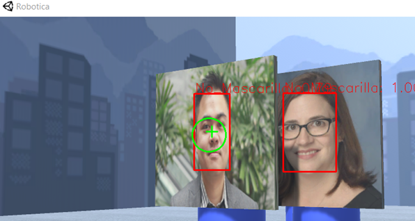
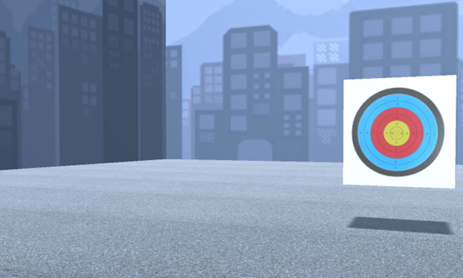

# Centinela-Nerf

# Tabla de contenidos
   * [Que es Centinela Nerf?](#que-es-Centinela-Nerf)
   * [Requerimientos](#requerimientos)
   * [Documentación](#documentacion)
   * [Como utilizarlo](#como-utilizarlo)

# Que es Centinela Nerf?

Centinela Nerf es un robot-torreta que detecta a personas sin mascarilla y les dispara una mascarilla para evitar que sigan contagiando a otras personas.

# Requerimientos

- Python 3.7 o más

- numpy

- openCV

- pytorch

- google cloud

- PyQt5

- threading

- pyautogui

- serial

- socket

- six

- gtts

- playsound

# Documentación

En este README enseña unos ejemplos de como funciona Centinela Nerf.

Para profundizar más en los algoritmos leer el informe.

# Como utilizarlo

1. Clonar el repositorio o descargarlo.

> git clone https://github.com/vamvictor/Centinela-Nerf

2. Instalar las librerias requeridas.

## Simulación Software

3. Abrir el ejecutable "Robotica.exe" de la carpeta Simulación Software.

4. Abrir el proyecto python de la carpeta Aplicacion y ejecutar el archivo Control.py.

5. Darle al botón "UNITY" para que se conecte con el ejecutable del Unity.

6. Si se quiere disparar manualmente antes hay que darle al botón "MOTORES" para que se enciendan los motores del robot

7. El cuadrado sirve para mover la torreta arriba, abajo, izquierda y derecha. El botón "DISPARAR" sirve para disparar una mascarilla.

8. Si se aprieta el boton "CENTINELA" se pondra la torreta en modo automatico y se bloqueara el modo manual, en este modo buscarà personas sin mascarillas y cuando las detecte le disparà una.

## Simulación Hardware

3. Pas 1

4. Pas 2

5. Pas 3

# Simulación en el Unity

## Movimiento y disparo de la torreta
El movimiento y disparo de la torreta se basará en los inputs que reciba de la aplicación (app Python) por la conexión del socket. 

## Modo centinela
En el modo centinela el roboto activará un movimiento de barrido para detectar esas personas que no llevan mascarilla, en caso de detectar una persona sin mascarilla, la torreta le avisará mediante unos mensajes y acabará lanzando una mascarilla a la persona para que la utilize.

## Modo juego
EL modo juego, es un modo basado para jugar con la torreta. El robot es buscará las dianas mediante un movimiento de barrido y lanzará las mascarillas para acertar en la diana. Si se confirma el contacto de la mascarillas con la diana se creara una nueva diana que el robot deberá buscar y empezar de nuevo el proceso.
